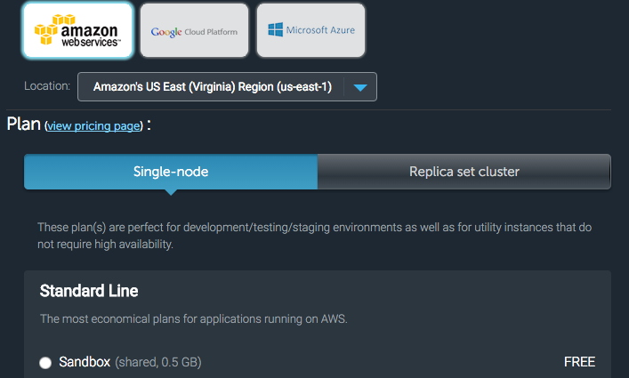
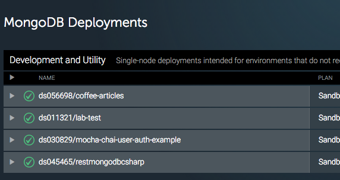

# Node, Mongo, Heroku Deployment Lab

Use Heroku + mlab to host MongoDB + your Node server on teh interwebz.

#### Accounts Required

You will need *two* _PaaS_ (Platform as a service) accounts. You should select the **free** account models and pricing for anything used in these labs. Free accounts are _perfect_ for testing (just not production). Before continuing...

* Register an MLab (formerly MongoLab) account: https://mlab.com/
* Register for a Heroku account: https://heroku.com

## Objectives

* Generate an Express application to serve to the internet.
* Add Mongoose Models and a Database connection to your Express application.
* Use the *environment variables* with `.env` & `dotenv` module to hide important data (such as your _connection string_) from public eyes.
* Use MLab (Database as a Service) to host a production ready MongoDB Database online.
* Use Heroku (Platform as a Service) to deploy a Node application online.
* Create a `Procfile` to tell Heroku to run your node app.

## Lab

#### Getting Started

1. Generate a basic Express application using [express-generate](https://ga-chicago.gitbooks.io/wdi-ravenclaw/content/07_fullstack_node/d04_express.html) (and `git init` if you haven't already).
2. Create a `db` and `models` folder for your Express project.
3. Install the following modules: `mongoose` and `dotenv`.
4. Add and commit everything.
5. Create a `.gitignore` (or edit an existing).
6. Inside of the `.gitignore`, on a new line add a new file to ignore: `.env`
7. Add and commit the gitignore. _Do not create the `.env` file yet_. We need to add and commit changes to our `.gitignore` **before** Git will start ignoring things. So we have to tell Git to ignore the `.env` file _before_ it begins ignoring it.
8. Now that you have committed, create the `.env` file.
9. Read the [dotenv](https://www.npmjs.com/package/dotenv) module documentation to learn how to include the module in your file. When mentioned to include a call _at the start of your project_, you can add that call **before** everything else in `app.js`.
10. In your `.env` file, add a **key** called `DB_HOST` with an empty value. Such value may appear as... `DB_HOST=`.
11. Add and commit. If you have not added a `remote` to your Git repository yet, you should do so now. Typically you would `git remote add name-of-remote git_url_here` to do so.

#### Hosting MongoDB on mlab and using it

1. Browse to https://mlab.com and login.
2. Select **Create New** ... 
3. Select any **Single Node** with a **Sandbox/Free Tier** from your preferred provider. _You will not need an account from any of these services; however for production use in the future you could integrate them_. 
4. Name your database something clever or obfuscated if you prefer. Then select **Create new MongoDB deployment**.
5. You'll be returned a list of databases. 
6. Select your Database.
7. You will then be provided a warning that _A Database user is required to connect to this database!_ Click on the link provided to create a new user.
8. Create a new user and password for your _root_ database account. This will be the user that can **CREATE**, **READ**, **UPDATE**, and **DESTROY** data. _Protip: You can create a read-only database user to hand out to other developers/data scientists/etc for testing/etc._
9. At the top of your page for **Database Users**, you will see two connection methods that _MLab_ provides. One is a shell connection string (for command line MongoDB access). The other is a URI for connecting with ORMs/ODMs (and other programmatic scripts/tools).
10. Copy the URI to your `.env` file where we had an empty `DB_HOST`. We now have the appropriate value! We can paste it here.
11. However... there is a problem. We need to add the MLab user's name and password here. Good thing we hid our `.env` with our `.gitignore`, amirite? Remove the `<user>` and `<password>` and replace them with the username and password for that user.
12. Add and commit. _Notice something funny?_
13. Now we need to create a `db/db.js` and a Model for a brand new collection. Let's start by making a `Taco` model. Create `db/db.js` and a `/models/Taco.js`.
15. Inside of your `db/db.js`, require `mongoose` and then create a variable called `var connectionString`. The value for this can be found using `process.env` to get appropriate value. If you are unsure (or confused), go back to the **npm dotenv** documentation and look at how to reference environment variables via keys from the `.env` file.
16. Use Mongoose to connect to your database. You should listen to the `connected`, `disconnected`, and `error` events. Log them out to verify that you are actually connecting.
17. Now, let's open that freshly created `models/Taco.js` file. Yum. Now, require mongoose.
18. Declare a new Schema for a taco. The taco should have at least a few attributes... _toppings_, _shellType_, _orderedFrom_ as Strings...?
19. Export your Schema using `mongoose.model`. The model's name will be `Taco`.
20. Add a persistent database connection to your app using the `db/db.js` file. Depending on your usage, your mileage and installation needs may vary.
21. Now, let's test this out - open the `routes/index.js` and create a new `get` route. The route will be `/tacos`.
22. Require your model - `var Taco = require('../models/Taco');`
23. In your `/tacos` **GET** route, use the `Taco` model to get all tacos and send them back to the client using Express Router's `response.json()` method.
24. Save your changes.
25. Run `npm start` (or `nodemon`) to run your server.
26. Browse to `localhost:3000/tacos` - what do you see? If you don't see an empty `[]` of 0 objects, something went wrong. Otherwise, good job!

#### Heroku Deployment

1. Heroku will allow a user to deploy 5 free proejcts. Log in.
2. Download/install the [Heroku toolbelt](https://toolbelt.heroku.com/).
3. You may need to restart your terminal session - just in case - before moving forward. Why? Because we just installed software to modify your terminal's environment and we need those changes.
4. We'll use the Heroku command line interface (CLI) to create an app on heroku for us. Let's do that now.
5. `heroku create your-app-name-here` - you should make sure your app name is unique and name it after something you would want to be public. For example if we did the prior, we could access it via https://your-app-name-here.herokuapp.com
6. Once this is done, add and commit everything.
7. Head over to your trusty `.env` file. Keep it open.
8. Browse back to Heroku. Open your application - you should see it listed on your Dashboard!
9. Select **Settings** on the top-right corner.
10. Scroll down to **Config Variables** and _reveal them_. You'll now need to transfer the contents of your `.env` to this area. This is a **secret, safe** place to store environment variables for your app on Heroku.
11. Because our `.env` never gets pushed, we have to add them physically somewhere. The **Config Variables** in Heroku is that place. Other platforms may have similar abilities.
12. Finally, we need to add **Node** support to our Heroku project.
13. In our repository, create a new file: `Procfile` (no extensions).
14. Inside of this file, we need to tell Heroku that this is a Node app. By default, it will likely assume we're writing in Ruby. That's no beuno. The `Procfile` should contain the following content: `web: npm start`
15. This tells `Heroku` to use `node` to call our `app.js`... which we declare in package.json's `start` script for `npm start`.
15. Add and commit.
16. Then `git push origin master` as well as `git push heroku master`.
17. Once done, you may call `heroku open` in the command line.
18. Your app should be up and running!
19. Browse to your `/tacos` route. What do you see?
20. Congrats - you've now deployed live! Good job.

#### Further Considerations

* Companies like General Assembly using PaaS solutions to deploy quickly.
* Why might this be awesome? What advantages do you see to using PaaS vs building your own virtual servers?
* Describe how the `.env` file works with the `.gitignore`.
* Explain why we need to use Heroku's Config Variables because of this.
* Who might you trust with all of your secret datas? Co-workers? Friends? Your grandma?
